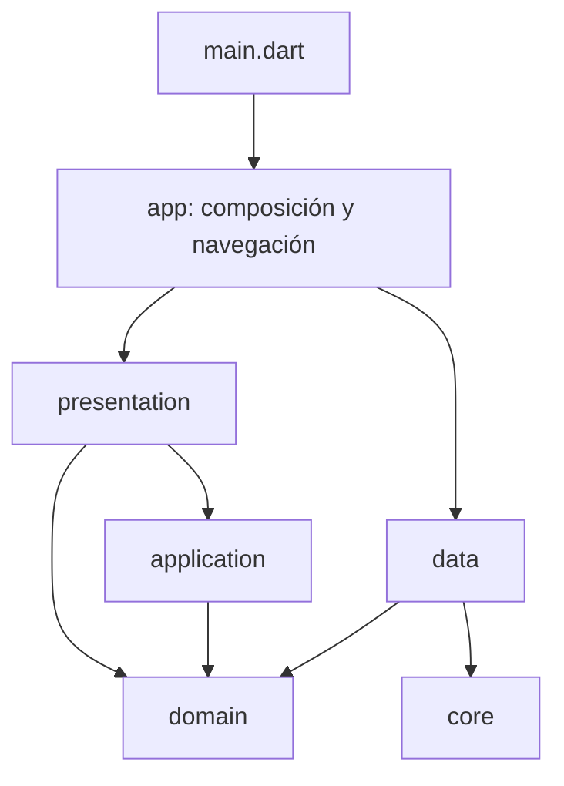

# Arquitectura técnica de App Catálogo

Estado documentado: 3 de agosto de 2026.

## Regla de oro

La estructura interna puede cambiar; el producto observable no. Todo refactor
debe conservar funcionalidad, reglas comerciales, diseño, textos, dimensiones,
navegación, estado, SQL, esquema, migraciones, transacciones y serialización.

Los cambios funcionales, visuales o de esquema pertenecen a tareas distintas.

## Criterio de organización

Todas las features obedecen las mismas reglas de dependencia, pero no tienen que
mostrar carpetas idénticas. Una carpeta existe sólo si contiene una
responsabilidad real y al menos un consumidor.

- `domain`: entidades, value objects, servicios puros y contratos.
- `application`: orquestación reutilizable que no pertenece a UI ni
  persistencia.
- `data`: datasources, modelos/mappers de persistencia e implementaciones de
  repositorio.
- `presentation`: BLoC/Cubit, páginas, secciones, diálogos y widgets.

Por tanto:

- no se crea `usecases` si la feature no usa casos de uso;
- no se crea `services` para guardar helpers genéricos;
- no se crea `models` sin un modelo de frontera real;
- no se conserva una feature vacía por una implementación hipotética.

Esta uniformidad semántica evita árboles artificialmente iguales pero vacíos.

## Dependencias permitidas

`app/` es la raíz de composición y puede conocer implementaciones concretas.
`core/` no depende de features. `domain/` no depende de Flutter, SQLite,
`data` ni `presentation`. `data/` no depende de `presentation`.

## Módulos vigentes

| Módulo | Responsabilidad |
| --- | --- |
| `auth` | Contratos futuros de identidad, roles dinámicos, permisos y alcance por vendedor. |
| `catalogo` | Productos, variantes, presentaciones, precios, imágenes y formulario. |
| `clientes` | Maestro de clientes y sus proyecciones de consulta. |
| `dashboard` | Proyección operativa de sólo lectura y acciones delegadas a repositorios. |
| `estructura_catalogo` | Empresas, marcas, categorías, atributos y relaciones. |
| `hojas_pedido` | Apertura, cierre, consulta e historial de hojas. |
| `home` | Resumen inicial y accesos. |
| `pedidos` | Pedidos, cotizaciones, preparación, consolidación, carga e historial. |

Las features vacías `carrito`, `cotizaciones` y `sync` fueron eliminadas.
La cotización real continúa perteneciendo a `pedidos`; no se cambió ownership
funcional.

## Reestructuración aplicada

### Composición, navegación y acceso

- `AppDependencies` concentra base, datasources y repositorios.
- `AppDestination` reemplaza índices anónimos sin cambiar sus valores.
- El rail vive en un widget propio y `MainShellPage` conserva su
  `IndexedStack`, montaje diferido, keys y callbacks.
- `AuthSession`, `AppRole`, `AppPermission`, `SellerScope`,
  `AuthRepository` y `RoleRepository` constituyen la base extensible.
- La sesión `legacyAdministrator` conserva usuario, rol, permisos y vendedor
  visibles actuales.

### SQLite

`AppDatabase` conserva:

- archivo `app_catalogo.db`;
- versión `22`;
- `PRAGMA foreign_keys = ON`;
- el mismo SQL, orden de creación, seed y cadena incremental de migraciones.

Su fachada contiene apertura y ciclo de vida. La implementación se distribuye
en:

- `core/database/schema/`;
- `core/database/migrations/`;
- `core/database/seeds/`.

Se usaron partes privadas de Dart para mover los mismos métodos sin ampliar la
API ni cambiar el orden de ejecución. Hay pruebas de creación limpia v22 y de
migración sintética v21 → v22 con conservación de registros.

### Pedidos

`PedidosLocalDatasource` quedó como fachada y sus responsabilidades están en
`data/datasources/pedidos/`: consultas, creación, edición, estados,
preparación, consolidado, cotizaciones, carga, clientes y mapeos.

Los bloques transaccionales se conservaron literalmente. Las pruebas verifican
commit conjunto y rollback cuando falla una clave foránea. Los builders de
persistencia que sí tienen uso viven en `data/models/`.

### Presentación

- `dashboard_page.dart` conserva la página y su estado; 18 bloques privados
  viven bajo `presentation/widgets/dashboard/`.
- Los pasos 4, 5 y 6 del formulario de producto están separados por
  responsabilidades bajo `presentation/sections/producto_form/`.
- El panel de estructura del catálogo separa modelos, formularios, pestañas,
  acciones y widgets.
- La gestión de atributos separa modelos, formulario y componentes auxiliares.
- Clientes, Pedidos, Hojas y Catálogo clasifican BLoC, páginas, secciones,
  diálogos, formularios y widgets por su responsabilidad real.

Las partes privadas mantienen acceso al estado existente y permiten una
extracción mecánica sin cambiar constructores ni árbol visual.

## Limpieza aplicada

- Cero carpetas vacías bajo `lib` y `test`.
- Cero features ficticias.
- Eliminados use cases, modelos, servicios, páginas y widgets sin consumidor.
- Eliminadas fachadas temporales de uno a tres exports y nombres
  `corregida`/`integrada`.
- Todos los imports de consumidores apuntan a la ubicación canónica.
- Se mantienen únicamente puertos públicos deliberados para acceso futuro y el
  barrel público real de las entidades de Dashboard.

## Guard automático

`test/architecture/dependency_rules_test.dart` verifica diez contratos:

1. `domain` no depende de capas externas ni frameworks.
2. `data` no depende de `presentation`.
3. `core` no depende de features.
4. Las features no dependen de `app`.
5. BLoC/event/state no dependen de elementos visuales.
6. Las páginas no importan datasources.
7. No existen archivos de respaldo.
8. No existen directorios vacíos.
9. No existen fachadas pequeñas ni nombres temporales.
10. Todo archivo fuente tiene consumidor o es un puerto deliberado.

## Escalabilidad futura

La base admite inyectar una sesión, roles configurables y alcance de vendedor,
pero no activa todavía login, administración ni filtrado multi-vendedor. Esas
funciones requieren migración de esquema, repositorios concretos y pruebas de
aislamiento. Véase [acceso y escalabilidad](access_and_scalability.md).

## Validación vigente

- Formato: 366 archivos conformes.
- Análisis: 0 errores, 0 warnings y 41 infos históricas.
- Gate estable: 130 pruebas aprobadas.
- Suite total: las mismas 130 aprobadas y los mismos 6 fallos históricos.
- Guard de arquitectura: 10 reglas aprobadas.
